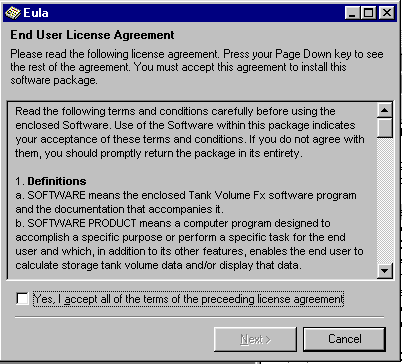



## Add a EULA to the PDW

### Description

Add a EULA form to the VB6 Package and Deployment Wizard
 
### More Info
 
See Index.htm for help for how to add to the PDW.

Untested on fresh system but it should work

Tested only on win98 box so far.

Reports welcome.

             |
---                |---
**Submitted On**   |2001-10-28 00:52:06
**By**             |[Sparky](https://github.com/Planet-Source-Code/PSCIndex/blob/master/ByAuthor/sparky.md)
**Level**          |Advanced
**User Rating**    |4.5 (18 globes from 4 users)
**Compatibility**  |VB 6\.0
**Category**       |[VB function enhancement](https://github.com/Planet-Source-Code/PSCIndex/blob/master/ByCategory/vb-function-enhancement__1-25.md)
**World**          |[Visual Basic](https://github.com/Planet-Source-Code/PSCIndex/blob/master/ByWorld/visual-basic.md)
**Archive File**   |[Add a EULA3153710282001\.zip](https://github.com/Planet-Source-Code/sparky-add-a-eula-to-the-pdw__1-28466/archive/master.zip)

